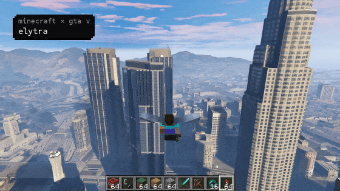

# INTERDIMENSIONAL GAMING

### Your favourite games, in the wrong universe.

Build a Minecraft house in Skyrim. Take a skateboard through a Call of Duty map. Bring Mario to an Elden Ring boss fight.

INTERDIMENSIONAL GAMING collects the mods and experiments that make those ridiculous combinations possible. This is the public companion to our CRT television website: discover the games behind the footage, find their original creators, and see what you can actually try.

**You don't need to know how to code to look around.** Start with the games below.

[Browse the games](#pick-your-universe) · [How to try one](START-HERE.md) · [Meet the creators](CREDITS.md) · [Suggest a mashup](CONTRIBUTING.md)

*Gameplay teaser by Rehan Sheikh and the Universal Modder contributors. [Original project](https://github.com/rehan-remade/universal-modder) · [Footage credits](CREDITS.md#the-tv-feed)*

## Pick your universe

Some connect two running games. Others bring one game's movement, maps or mechanics into another. The result is what we're here for: familiar games doing things they weren't built to do.

### The original collection

| Mashup | What's the idea? | Start here |
| --- | --- | --- |
| **Minecraft × Skyrim** | Minecraft building, movement and combat in Skyrim's world. | [SkyCraft](games/README.md#minecraft--skyrim) |
| **Minecraft × GTA V** | Blocks, mobs and Minecraft chaos in Los Santos. | [Universal Modder](games/README.md#minecraft--gta-v) |
| **Skate 3 × MW2 × Minecraft** | Skate through a Modern Warfare 2 map, or switch to a Minecraft world. | [2010 Mashup](games/README.md#skate-3--modern-warfare-2--minecraft) |
| **Minecraft × GTA IV** | Minecraft gameplay in Liberty City. | [LibertyCraft](games/README.md#minecraft--gta-iv) |
| **Minecraft × Elden Ring** | Build and explore across the Lands Between. | [Original bridge and Windows adaptation](games/README.md#minecraft--elden-ring) |
| **Minecraft × Monster Hunter: World** | Minecraft gameplay meets Monster Hunter's world. | [Crossover bridge](games/README.md#minecraft--monster-hunter-world) |
| **DOOM × Minecraft** | Play DOOM without leaving Minecraft. | [NucleDoom](games/README.md#doom--minecraft) |
| **DOOM × Hytale** | Play DOOM on Hytale's in-game map display. | [DoomMaps](games/README.md#doom--hytale) |

The TV teaser also features **Halo × Minecraft** and **World at War × Minecraft**. Those are documented demonstrations, not separate ready-to-install games in this collection.

### More worlds to break

Added after checking the original projects on **6 October 2026**.

| Mashup | What's the idea? | Start here |
| --- | --- | --- |
| **Minecraft × Valheim** | Build with blocks in a Viking world, then bring Minecraft weapons to its creatures. | [ValCraft — download available](games/README.md#minecraft--valheim) |
| **Minecraft × Fallout 4** | Build a blocky base in the Commonwealth and fight raiders with Minecraft gear. | [FalloutCraft — download available](games/README.md#minecraft--fallout-4) |
| **Minecraft × Outer Wilds** | Land on a planet, step out of your ship, and start building. | [OWCraft — download available](games/README.md#minecraft--outer-wilds) |
| **Minecraft × ULTRAKILL** | Take swords, shields, TNT and blocks through ULTRAKILL's levels. | [Killcraft — download available](games/README.md#minecraft--ultrakill) |
| **Skate 3 × Garry's Mod** | Skate on Garry's Mod maps, with friends, tricks and a park editor. | [SkateGM — download available](games/README.md#skate-3--garrys-mod) |
| **Mario 64 × Elden Ring** | Triple-jump, wall-kick and ground-pound through the Lands Between. | [ER Mario — download available](games/README.md#mario-64--elden-ring) |
| **Skate 3 × Bully** | Jimmy gets Skate 3 physics to ride around Bullworth. | [BullySkate — download available](games/README.md#skate-3--bully) |
| **Skate 3 × GTA San Andreas** | CJ gets a proper Skate-style board, tricks and grinds. | [GTA San AnSkateas — download available](games/README.md#skate-3--gta-san-andreas) |

**One to follow:** [SubCraft — Minecraft × Subnautica](games/README.md#minecraft--subnautica). It's still in early development, not a finished download.

“Download available” means the creator provides files to install. It doesn't mean one-click setup, that we've play-tested it, or that it works on every PC. The [game guide](games/README.md) explains the basics.

## Want to play?

Start with [the beginner guide](START-HERE.md). You usually need your own copies of the games, the right versions, and a few mods. Most of the additions above target Windows.

Use the creator's download and instructions rather than GitHub's green **Code** button. That button downloads the project files, which often aren't ready to play.

## What's in this repo?

| Where to go | What you'll find |
| --- | --- |
| [Game guide](games/README.md) | What each mashup does, who made it, and how to get started. |
| [Beginner guide](START-HERE.md) | Downloads, mod setup and unfamiliar words explained. |
| [Creator credits](CREDITS.md) | The people behind the games and the TV footage. |
| [Source archive](games/SOURCE-ARCHIVE.md) | Saved copies of selected projects for people who want to explore the code. |
| [Research](research/README.md) | Evidence, footage records and older research notes. |

We curate this collection; the original creators built the mods. Listing a project isn't a claim that its creator supports our coin or is part of our team. The website code stays in a separate private repo.

## Found something we should see?

Send us a [game suggestion](CONTRIBUTING.md), or [report a correction](https://github.com/connorplaz14-blip/interdimensional-gaming/issues/new). A creator link and a clear demo are a great start. If you're a featured creator and want a credit changed or a clip removed, use the same link and tell us which one.
